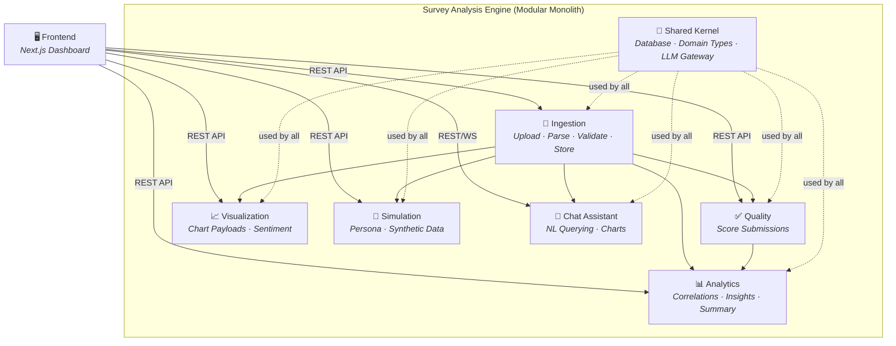
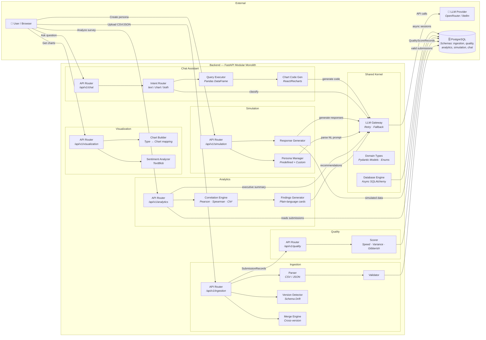

# Survey Analysis Engine — System Overview

## Architecture Style: Modular Monolith

The system is a **single-deployable FastAPI application** organized into **7 internal modules** with strict boundary rules. All modules live in one process and share a single PostgreSQL database (with separate schemas per module). Inter-module communication happens only through each module's **public interface** (`interfaces/api.py`), never by importing internals directly.

---

## Module Descriptions

### 1. 🔌 Ingestion Module (`src/ingestion/`)

**Purpose:** The data entry point. Handles uploading, parsing, validating, and persisting survey data.

- **Parser** — Accepts CSV and JSON file uploads and converts them into a list of response dictionaries.
- **Validator** — Validates each record's structure (correct types, non-empty keys).
- **Version Detector** — Automatically detects when incoming data diverges from an existing survey schema (new/removed questions, type changes). Infers data types (BOOLEAN, NOMINAL, ORDINAL, INTERVAL, OPEN_ENDED, etc.) using heuristic sampling.
- **Merge Engine** — Reconciles and merges submissions from two different schema versions into a unified dataset using field mapping (exact ID match → text-based fuzzy match → leftovers).
- **Auto-Ingest** — An upload-first flow that infers a schema from the data columns and types, creates it, then ingests all records.
- **DB Schema:** `ingestion` — tables: `survey_schemas`, `submissions`, `ingestion_logs`.

### 2. ✅ Quality Module (`src/quality/`)

**Purpose:** Scores every survey submission for response quality using three heuristic sub-scores.

- **Scorer** — Computes a composite quality score (0–1) from three dimensions:
  - **Speed Score (30%)** — Penalizes suspiciously fast completions (< 30 seconds).
  - **Variance Score (40%)** — Detects "straight-lining" (≥ 85% identical answers).
  - **Gibberish Score (30%)** — Flags repeated characters, repetitive words, or low alphabetic ratio.
- **Quality Grade** — Maps composite score to `HIGH` (≥ 0.7), `MEDIUM` (≥ 0.4), or `LOW`.
- **Quality Toggle (FR-05)** — Provides a filter so downstream modules can exclude low-quality submissions.
- **DB Schema:** `quality` — table: `quality_scores`.

### 3. 📊 Analytics Module (`src/analytics/`)

**Purpose:** Runs statistical analysis on survey responses and generates human-readable insights.

- **Correlation Engine** — Performs pairwise statistical correlation between survey variables. Selects the appropriate method automatically:
  - **Chi-Square** — for nominal/categorical pairs.
  - **Pearson** — for two interval (numeric) variables.
  - **Spearman** — for ordinal or mixed types.
- **Findings Generator** — Converts raw correlation results into plain-language "finding cards" with headlines, explanations, severity levels, and LLM-generated actionable recommendations.
- **Executive Summary** — Uses the LLM Gateway to produce a full natural-language executive summary of the survey findings.
- **Full Analysis Pipeline** — A single `analyze_full()` call chains: correlations → findings → executive summary.
- **DB Schema:** `analytics` — tables: `correlation_results`, `insights`, `executive_summaries`.

### 4. 📈 Visualization Module (`src/visualization/`)

**Purpose:** A stateless service that transforms raw survey data into chart-ready payloads for the frontend.

- **Data-Type-Driven Chart Mapping** — Automatically selects the right chart type per data type:
  - BOOLEAN → Pie chart
  - NOMINAL → Bar chart (horizontal if many categories)
  - ORDINAL → Bar chart (preserving natural order)
  - INTERVAL → Histogram with summary statistics
  - MULTI_SELECT → Stacked bar chart
  - OPEN_ENDED → Word cloud + sentiment distribution chart
- **Sentiment Analysis (FR-11)** — Uses TextBlob to compute polarity/subjectivity on open-ended text responses.
- **Full Dashboard Builder** — Generates chart payloads for every question in a survey in one call.
- **Stateless** — Owns no database tables; computes everything on the fly from ingested data.

### 5. 🧪 Simulation Module (`src/simulation/`)

**Purpose:** Generates synthetic survey responses using LLM-powered persona simulation.

- **Predefined Personas (FR-14)** — Ships with a library of default respondent archetypes (e.g., "Average User", "Detail-Oriented Expert", "Disengaged Respondent").
- **Custom Personas (FR-15/FR-16)** — Users can describe a persona in natural language; the LLM parses it into structured parameters (age, personality traits, response style, etc.).
- **Simulation Runner (FR-17)** — Takes a persona + a survey schema's questions and prompts the LLM to generate realistic survey responses. All simulated submissions are marked `is_simulated=True`.
- **DB Schema:** `simulation` — tables: `personas`, `simulated_responses`.

### 6. 💬 Chat Assistant Module (`src/chat_assistant/`)

**Purpose:** A conversational interface that lets users query their survey data using natural language.

- **Intent Router** — LLM classifies each user message into one of three intents:
  - `text_answer` — Generate a text-only analytical answer.
  - `chart` — Generate a dynamic Recharts visualization.
  - `both` — Text explanation + chart together.
- **Query Translator** — LLM generates a structured query spec (operation, column, filters, group_by) from the natural language question.
- **Query Executor** — Executes the structured spec against an in-memory Pandas DataFrame. Supports: `count`, `sum`, `mean`, `median`, `min`, `max`, `distinct`, `distribution`, and `group_by`.
- **Chart Code Generator** — LLM generates a sandboxed React/Recharts component string for rendering dynamic charts on the frontend. Includes security validation (blocked patterns: `import`, `fetch`, `eval`, etc.).
- **Persona Interview (FR-23)** — Users can "interview" a simulated persona in a chat session.
- **WebSocket Support** — Real-time chat via WebSocket endpoint.
- **DB Schema:** `chat` — tables: `chat_sessions`, `chat_messages`.

### 7. 🧩 Shared Kernel (`src/shared_kernel/`)

**Purpose:** The foundational layer. Provides cross-cutting infrastructure that ALL modules depend on.

- **Database Engine** — Async SQLAlchemy engine, session factory, ORM `Base` class, and schema/table creation utilities.
- **Domain Types** — Canonical Pydantic models and enumerations shared across all modules: `SurveySchemaRecord`, `SubmissionRecord`, `QualityScoreRecord`, `CorrelationResultRecord`, `InsightRecord`, `QuestionDefinition`, and all enums (`DataType`, `QualityGrade`, `CorrelationMethod`, etc.).
- **LLM Gateway** — The **single authorized interface** to external LLM providers (via `litellm`). Provides retry logic and fallback model switching. All modules MUST use this; no module may import `openai`/`anthropic` directly.
- **Public API** — Exposed through `__init__.py`; this is the ONLY import path other modules should use.

---

## Mermaid Diagrams

### Diagram 1 — Level 1: High-Level Module Relationships (Bird's Eye View)

A simplified view showing each module as a box and the primary data flow direction.

---

### Diagram 2 — Level 2: Data Flow & Inter-Module Communication

A more detailed view showing _what data_ flows between modules and external systems.

---

### Diagram 3 — Level 3: Detailed Internal Architecture (Component-Level)

The most detailed view, showing classes, internal dependencies, database tables, and the full request lifecycle.

```mermaid
graph TB
    classDef shared fill:#e8d5f5,stroke:#7c3aed,stroke-width:2px
    classDef ingestion fill:#dbeafe,stroke:#2563eb,stroke-width:2px
    classDef quality fill:#d1fae5,stroke:#059669,stroke-width:2px
    classDef analytics fill:#fef3c7,stroke:#d97706,stroke-width:2px
    classDef visualization fill:#ffe4e6,stroke:#e11d48,stroke-width:2px
    classDef simulation fill:#e0e7ff,stroke:#4338ca,stroke-width:2px
    classDef chat fill:#ccfbf1,stroke:#0d9488,stroke-width:2px
    classDef db fill:#f3f4f6,stroke:#374151,stroke-width:2px
    classDef external fill:#fef9c3,stroke:#ca8a04,stroke-width:2px

    %% ── SHARED KERNEL ──
    subgraph SK["🧩 Shared Kernel"]
        direction TB
        SK_BASE["Base<br/><i>DeclarativeBase</i>"]:::shared
        SK_ENGINE["create_async_engine<br/>async_session_factory"]:::shared
        SK_SESSION["get_db_session()<br/><i>FastAPI Dependency</i>"]:::shared
        SK_TYPES["Domain Types<br/>─────────────<br/>SurveySchemaRecord<br/>SubmissionRecord<br/>QualityScoreRecord<br/>CorrelationResultRecord<br/>InsightRecord<br/>QuestionDefinition"]:::shared
        SK_ENUMS["Enums<br/>─────────────<br/>DataType · QualityGrade<br/>CorrelationMethod<br/>IngestionStatus<br/>PersonaType<br/>ChatSessionType"]:::shared
        SK_GW["LLMGateway<br/>─────────────<br/>complete(LLMRequest) → LLMResponse<br/>Primary + Fallback model<br/>Retry logic"]:::shared

        SK_ENGINE --> SK_SESSION
        SK_BASE --> SK_ENGINE
    end

    %% ── INGESTION MODULE ──
    subgraph ING["🔌 Ingestion Module"]
        direction TB
        ING_SVC["IngestionService<br/>─────────────<br/>create_survey_schema()<br/>ingest_file()<br/>auto_ingest()<br/>detect_version()<br/>merge_versions()"]:::ingestion
        ING_REPO["IngestionRepository<br/><i>CRUD operations</i>"]:::ingestion
        ING_PARSE["parse_upload()<br/><i>CSV ↔ JSON</i>"]:::ingestion
        ING_VAL["validate_structure()<br/><i>Type & key checks</i>"]:::ingestion
        ING_VDET["VersionChange<br/>detect_version_change()<br/><i>added · removed · type_changes</i>"]:::ingestion
        ING_MERGE["FieldMapping<br/>build_field_mapping()<br/>merge_submissions()"]:::ingestion

        ING_SVC --> ING_REPO
        ING_SVC --> ING_PARSE
        ING_SVC --> ING_VAL
        ING_SVC --> ING_VDET
        ING_SVC --> ING_MERGE
    end

    subgraph ING_DB["Ingestion DB Schema"]
        ING_T1["survey_schemas<br/><i>id · title · version_id<br/>question_definitions · created_at</i>"]:::db
        ING_T2["submissions<br/><i>id · survey_schema_id<br/>raw_responses · source_format<br/>is_valid · received_at</i>"]:::db
        ING_T3["ingestion_logs<br/><i>id · survey_schema_id<br/>status · records_received<br/>records_valid</i>"]:::db
    end

    %% ── QUALITY MODULE ──
    subgraph QA["✅ Quality Module"]
        direction TB
        QA_SVC["QualityService<br/>─────────────<br/>score_submission()<br/>score_submissions_batch()<br/>filter_by_quality()"]:::quality
        QA_REPO["QualityRepository"]:::quality
        QA_SCORER["QualityScorer<br/>─────────────<br/>_score_speed() → 0.3 weight<br/>_score_variance() → 0.4 weight<br/>_score_gibberish() → 0.3 weight<br/>─────────────<br/>≥0.7 → HIGH<br/>≥0.4 → MEDIUM<br/><0.4 → LOW"]:::quality

        QA_SVC --> QA_SCORER
        QA_SVC --> QA_REPO
    end

    subgraph QA_DB["Quality DB Schema"]
        QA_T1["quality_scores<br/><i>id · submission_id · grade<br/>speed/variance/gibberish/composite</i>"]:::db
    end

    %% ── ANALYTICS MODULE ──
    subgraph AN["📊 Analytics Module"]
        direction TB
        AN_SVC["AnalyticsService<br/>─────────────<br/>run_correlation_analysis()<br/>generate_executive_summary()<br/>analyze_full()"]:::analytics
        AN_REPO["AnalyticsRepository"]:::analytics
        AN_CORR["CorrelationEngine<br/>─────────────<br/>analyze_pair()<br/>_select_method()<br/>─────────────<br/>Nominal → Chi²<br/>Interval × Interval → Pearson<br/>Otherwise → Spearman"]:::analytics
        AN_FIND["FindingsGenerator<br/>─────────────<br/>generate_findings()<br/>_generate_headline()<br/>_generate_explanation()<br/>_generate_recommendations_batch()"]:::analytics

        AN_SVC --> AN_REPO
        AN_SVC --> AN_CORR
        AN_SVC --> AN_FIND
    end

    subgraph AN_DB["Analytics DB Schema"]
        AN_T1["correlation_results<br/><i>id · survey_schema_id<br/>independent/dependent_variable<br/>method · statistic · p_value</i>"]:::db
        AN_T2["insights<br/><i>id · correlation_result_id<br/>insight_text · severity</i>"]:::db
        AN_T3["executive_summaries<br/><i>id · survey_schema_id<br/>summary_text</i>"]:::db
    end

    %% ── VISUALIZATION MODULE ──
    subgraph VIZ["📈 Visualization Module (Stateless)"]
        direction TB
        VIZ_SVC["VisualizationService<br/>─────────────<br/>build_chart_payloads()<br/>build_full_dashboard()<br/>analyze_sentiment()"]:::visualization
        VIZ_BOOL["_build_boolean() → Pie"]:::visualization
        VIZ_NOM["_build_nominal() → Bar"]:::visualization
        VIZ_ORD["_build_ordinal() → Bar (ordered)"]:::visualization
        VIZ_INT["_build_interval() → Histogram"]:::visualization
        VIZ_MS["_build_multi_select() → Stacked Bar"]:::visualization
        VIZ_OE["_build_open_ended() → WordCloud + Sentiment"]:::visualization

        VIZ_SVC --> VIZ_BOOL
        VIZ_SVC --> VIZ_NOM
        VIZ_SVC --> VIZ_ORD
        VIZ_SVC --> VIZ_INT
        VIZ_SVC --> VIZ_MS
        VIZ_SVC --> VIZ_OE
    end

    %% ── SIMULATION MODULE ──
    subgraph SIM["🧪 Simulation Module"]
        direction TB
        SIM_SVC["SimulationService<br/>─────────────<br/>seed_default_personas()<br/>create_custom_persona()<br/>run_simulation()"]:::simulation
        SIM_REPO["SimulationRepository"]:::simulation

        SIM_SVC --> SIM_REPO
    end

    subgraph SIM_DB["Simulation DB Schema"]
        SIM_T1["personas<br/><i>id · name · type<br/>description_prompt<br/>parsed_parameters</i>"]:::db
        SIM_T2["simulated_responses<br/><i>id · persona_id<br/>survey_schema_id<br/>responses · is_simulated</i>"]:::db
    end

    %% ── CHAT ASSISTANT MODULE ──
    subgraph CHAT["💬 Chat Assistant Module"]
        direction TB
        CHAT_SVC["ChatAssistantService<br/>─────────────<br/>start_session()<br/>send_message()<br/>get_history()"]:::chat
        CHAT_REPO["ChatRepository"]:::chat
        CHAT_TRANS["QueryTranslator<br/>─────────────<br/>classify_intent()<br/>generate_text_answer()<br/>generate_chart_code()"]:::chat
        CHAT_EXEC["QueryExecutor<br/>─────────────<br/>execute(spec) → result<br/>prepare_chart_data()<br/><i>Pandas DataFrame engine</i>"]:::chat

        CHAT_SVC --> CHAT_REPO
        CHAT_SVC --> CHAT_TRANS
        CHAT_SVC --> CHAT_EXEC
    end

    subgraph CHAT_DB["Chat DB Schema"]
        CHAT_T1["chat_sessions<br/><i>id · survey_schema_id<br/>session_type · created_at</i>"]:::db
        CHAT_T2["chat_messages<br/><i>id · session_id · role<br/>content · chart_code<br/>executed_query</i>"]:::db
    end

    %% ── EXTERNAL ──
    FE["🖥️ Next.js Frontend<br/><i>Dashboard · Charts · Chat UI</i>"]:::external
    LLM_EXT["🤖 LLM Provider<br/><i>OpenRouter</i>"]:::external
    PG["🗄️ PostgreSQL"]:::external

    %% ── CONNECTIONS ──
    FE -->|"POST /api/v1/ingestion/*"| ING_SVC
    FE -->|"GET/POST /api/v1/quality/*"| QA_SVC
    FE -->|"POST /api/v1/analytics/*"| AN_SVC
    FE -->|"POST /api/v1/visualization/*"| VIZ_SVC
    FE -->|"POST /api/v1/simulation/*"| SIM_SVC
    FE -->|"POST + WebSocket"| CHAT_SVC

    ING_SVC -->|"triggers scoring"| QA_SVC
    QA_SVC -->|"quality filter"| AN_SVC
    AN_SVC -->|"reads submissions from"| ING_SVC
    VIZ_SVC -->|"reads submissions from"| ING_SVC
    CHAT_SVC -->|"reads schema + data from"| ING_SVC
    SIM_SVC -->|"reads schema from"| ING_SVC

    AN_FIND -->|"LLM recommendations"| SK_GW
    AN_SVC -->|"executive summary"| SK_GW
    SIM_SVC -->|"persona parsing + generation"| SK_GW
    CHAT_TRANS -->|"intent + query + chart"| SK_GW
    SK_GW -->|"API calls"| LLM_EXT

    ING_REPO --> PG
    QA_REPO --> PG
    AN_REPO --> PG
    SIM_REPO --> PG
    CHAT_REPO --> PG

    SK_SESSION -.->|"injected into all services"| ING_SVC
    SK_SESSION -.->|"injected into all services"| QA_SVC
    SK_SESSION -.->|"injected into all services"| AN_SVC
    SK_SESSION -.->|"injected into all services"| SIM_SVC
    SK_SESSION -.->|"injected into all services"| CHAT_SVC
```

---

## Key Architectural Rules

| Rule                        | Description                                                                                             |
| --------------------------- | ------------------------------------------------------------------------------------------------------- |
| **FF-01**                   | Modules may only call each other through `interfaces/api.py`. No importing from `internals/`.           |
| **FF-02**                   | All shared types come from `shared_kernel`. No module defines its own overlapping types.                |
| **FF-03**                   | All LLM calls go through `shared_kernel.llm_gateway`. No direct `openai`/`anthropic` imports.           |
| **Separate DB Schemas**     | Each module owns its own PostgreSQL schema (`ingestion`, `quality`, `analytics`, `simulation`, `chat`). |
| **Stateless Visualization** | The Visualization module owns no database tables — it computes chart payloads on the fly.               |
| **Single Deployable**       | All modules are registered as FastAPI routers on a single application instance (`src/main.py`).         |
